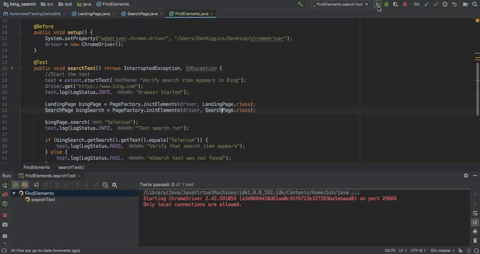

# Testing-Projects
A range of online automated tests using Selenium and the chrome driver.
All projects will function correctly, as long as chrome driver is installed in desired path.

The following automated tests have been utilised - all projects are mavern with the required dependenceies:
   - Selenium
   - Cucumber
   - Katalon
   - JUnit
   - Extent Reports

## Bing Search
This project using selenium as well as the chrome driver to automate a bing search and test that a panel showing the search item is displayed.

>"a picture is worth a thousand words, a video is worth a million."

